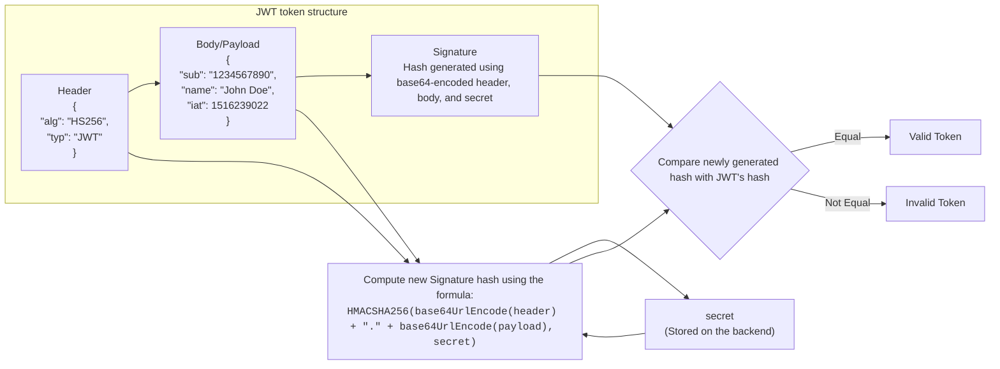

## Encoding vs Encryption vs Hashing

### Encoding
Plain text ---[Encoding]---> Encoded text ---[Decoding]---> Plain text
### Encryption
Plain text ---[Encryption + key]---> Encrypted text  ---[Decryption + key]---> Plain text

- symmetric encryption: the same key is used to encrypt and decrypt the data. Algorithms like AES, Triple DES and BlowFish
- asymmetruc encryption: it use public key for encryption and private key for decryption. Algorithms like Rivest-Shamir-Adleman(RSA), Pretty Good Privacy (PGP)
#### Rainbow table/ Dictionary table attack
- It involves storing a large number of password hashes along with their corresponding plaintext passwords in a table.
- Plain text password + Random salt value + Hashing Algo = Protecting from Rainbow attacks

### Hashing
Plain text ---[Hash funtcion]---> digest or hash

### CORS and CSRF
- cors = cross-origin resource sharing
- csrf = cross-site request forgery

### JWT = Json Web Token
#### 3 parts,each separated by a period (.)
- header - store metadata/info related with token
- payload - store detail related with user, roles etc.
- signature(optional) - digital signature to make sure that no one tampered the data on the network

